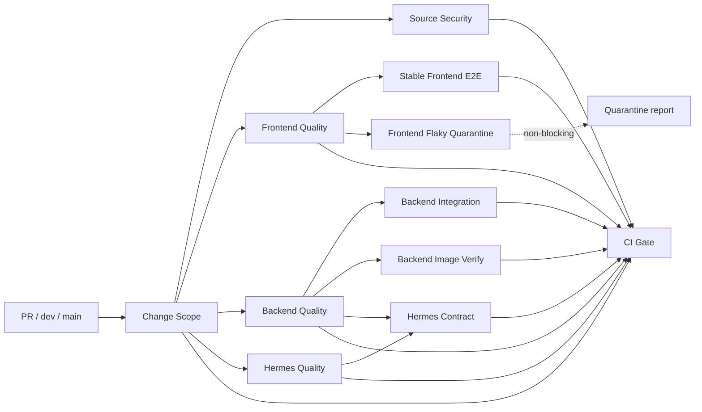

# GitHub CI 与合并门禁

`.github/workflows/ci.yml` 是 GitHub 的单体仓库 CI，在 `dev`、`main` 的
push、pull request 以及手动触发时运行。Workflow 不使用顶层 `paths`
过滤；所有运行都产生稳定的 `CI Gate`。

## Workflow DAG

`Backend Integration` 和 `Backend Image Verify` 在 `Backend Quality` 成功后
并行。镜像构建、Trivy 镜像扫描、迁移、容器启动、健康检查和 smoke test
位于同一个 runner，不依赖跨 Job 的本地镜像或服务。

## Change Scope

`Change Scope` 使用完整 Git 历史计算以下输出：

- `frontend_changed`
- `backend_changed`
- `hermes_changed`
- `docker_changed`
- `shared_changed`
- `docs_only`

脚本处理 PR base/head、普通 push、merge commit、手动运行、首次 push 和
全零/不可用 before SHA。无法可信解析 base 时按完整 HEAD 文件树执行，
以增加验证代价换取不漏跑门禁。

纯 `docs/` 或 Markdown、MDX、reStructuredText 变更只运行 Change Scope、
Source Security 和 CI Gate。`.github` Workflow、根配置、`.ci`、`.gitea`、
共享脚本与 OpenAPI 契约属于 shared change，会触发全部相关模块。

Change Scope 同时运行 `.ci/test-impact-policy.toml`，生产代码变更没有对应
测试时直接失败。

## 检查内容

### Frontend

`Frontend Quality` 一次安装依赖后执行生成 API 契约漂移、ESLint、
TypeScript、Vitest coverage、80% 变更行覆盖率、Next.js production build、
Compose 校验和前端 Docker build。

`Stable Frontend E2E` 重新构建 production bundle，通过 standalone server 运行
`e2e/purchasing` 且排除 `@flaky`。CI 只允许一次测试级重试；失败时上传
Playwright HTML、trace、截图和视频。

`Frontend Flaky Quarantine` 只运行带 `@flaky` 的测试，Job
`continue-on-error` 且不进入 CI Gate。当前没有隔离测试，因此只写 Step
Summary。新增隔离项必须在测试标题或邻近注释记录 Issue、隔离原因、负责人和
计划修复日期。

### Backend

`Backend Quality` 执行 AgentBackend V2 残留检查、变更 Python 文件 Ruff、
compileall、现有 `mypy app/core` 基线和 unit/core 测试。

`Backend Integration` 使用独立 PostgreSQL 17 和 Redis 8，检查唯一 Alembic
head、空库 upgrade、model/migration drift、FastAPI import、OpenAPI 漂移，
然后运行全量 Pytest、60% 行覆盖率、33.5% 分支覆盖率和 80% 变更行覆盖率。

`Backend Image Verify` 使用 `${GITHUB_SHA}` 标记镜像并通过 Buildx/GHA cache
只构建一次。完整漏洞报告作为 artifact；存在有修复版本的 High/Critical
漏洞时阻塞。容器使用隔离 Docker network 和临时 PostgreSQL/Redis。

### Hermes

`Hermes Quality` 执行残留检查、编译、Dazah 自有兼容边界的 Ruff 和全量
Pytest。固定上游 Hermes 源码不纳入新增的全库 Ruff 门禁，避免用本项目配置
约束禁止本地修改的上游快照。

`Hermes Contract` 使用自己的 PostgreSQL/Redis 环境，运行后端 Agent V2、
Tool Registry、执行入口、权限和参数契约，以及 Hermes
search/describe/execute adapter、OpenAPI 路径、超时和服务不可用契约。

### Security

`Source Security` 始终运行 Trivy filesystem
`vuln,secret,misconfig` 扫描。完整严重度报告非阻塞上传；Secret 或有修复版本
的 High/Critical 漏洞及配置问题阻塞。不维护大范围 ignore，当前也没有
`.trivyignore`。

所有外部 Action 使用完整 commit SHA，Workflow 默认权限只有
`contents: read`。PR 不推送正式镜像。

## CI Gate 语义

`CI Gate` 使用 `if: always()`，对每个阻塞 Job 同时检查 scope 预期和
`needs.<job>.result`：

- 模块未变化且 Job 为 `skipped`：允许；
- 模块变化且 Job 为 `success`：允许；
- 模块变化但 Job 为 `skipped`：失败；
- 任意阻塞 Job 为 `failure` 或 `cancelled`：失败；
- Change Scope 或 Source Security 不是 `success`：失败。

Gate 会将 scope 和“Job、预期、实际结果、结论、原因”表格写入
GitHub Step Summary。Quarantine 不在 Gate 的 `needs` 中。

## GitHub Ruleset / Branch Protection

先让新 Workflow 在一个 PR 上至少成功运行一次，使 GitHub 注册检查名，然后：

1. 打开仓库 **Settings → Rules → Rulesets**（或 Branch protection rules）。
2. 为 `dev` 和 `main` 启用 Require a pull request before merging。
3. 启用 Require status checks to pass，Required check 只选择 `CI Gate`。
4. 启用 Require branches to be up to date before merging。
5. 对 `main` 启用 Block force pushes、Block deletions，并限制直接 push；
   管理员是否允许 bypass 按组织治理要求设置。
6. 新 Gate 稳定后，移除旧的 `Frontend Test`、`Backend Test`、
   `Backend Docker Build`、`Hermes Test` 等 Required Checks。

Workflow 没有生产发布逻辑。以后接入发布时，发布 Job 必须
`needs: ci-gate`，并只允许在目标分支的 `push` 事件执行。

## Nightly

本次不创建 nightly Workflow。仓库出现有完整隔离元数据的真实 `@flaky`
测试后，再增加夜间全量 E2E、quarantine、完整安全扫描和长集成测试；nightly
不得成为现有 PR 的 Required Check。
