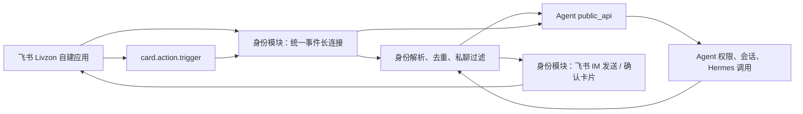

# Livzon 飞书双向对话详细 Spec

> 版本：v1.0  
> 状态：已实施，待飞书开放平台实际环境验收  
> 对应任务账本：`docs/tasks/livzon-feishu-bidirectional-chat-tasks-2026-07-10.md`

## 1. 背景与目标

当前 Livzon 助手可通过配置在 `identity.feishu_configs` 中的飞书自建应用向本地用户发送文本、卡片和交互卡片，但不能处理用户发给该机器人的消息。平台全局飞书应用虽然注册了 `im.message.receive_v1`，其处理器仅做 Redis 去重和日志记录，且并非使用 Livzon 专属应用凭证。

本功能将 Livzon 专属应用升级为双向私聊机器人：飞书消息触发与 Web 端一致的 Livzon 权限校验、Agent 对话、工具确认和审计链路；机器人在同一私聊中回发结果。业务模块不得因该功能直接接入飞书或直接访问 Agent 内部实现。

首版成功标准：

1. 已同步且拥有有效 Livzon 范围的用户，向 Livzon 机器人发送文本后能收到 Agent 的完整回复。
2. 同一用户的后续私聊能复用飞书渠道会话；发送 `/new` 或 `/新建会话` 后从新上下文开始。
3. 需要普通确认的写操作会生成仅限本人操作的确认卡片；确认或取消后可安全完成闭环。
4. 未映射、停用、无权限、群聊、机器人消息、非文本和重复消息不会执行 Agent。

## 2. 范围与产品行为

### 2.1 首版范围

| 场景 | 行为 |
| --- | --- |
| 用户与 Livzon 机器人的私聊文本 | 调用 Agent，回发完整文本答案。 |
| `/new`、`/新建会话` | 归档当前飞书渠道会话，回复“已开启新对话”，不调用 Agent。 |
| 普通写操作的待确认项 | 回发原始 Agent 文本，并为每项待确认操作发送交互卡片。 |
| 确认卡片点击 | 仅原收件人可确认或取消；执行后卡片更新为结果状态。 |
| 不支持的私聊消息类型 | 回复“当前仅支持文本消息，请发送文字描述”。 |

### 2.2 明确不在首版范围

- 群聊和群内 @ 机器人的消息。
- 图片、文件、语音、视频、富文本及消息引用解析。
- 流式更新、分段发送或消息编辑式输出。
- 未同步用户的访客模式、自动建本地账户或自动授予 Livzon 范围。
- 人工责任判断类操作的机器人确认执行。
- 会话摘要、自动截断或跨渠道合并 Web/飞书会话。

## 3. 架构与模块边界



### 3.1 身份模块职责

- 从 `identity.feishu_configs` 获取 Livzon 自建应用凭证，建立、重连、停止飞书长连接。
- 接收并过滤飞书事件，解析文本与发送者 `open_id`，根据 `identity.users.feishu_open_id` 解析本地用户。
- 使用已有飞书 IM helper 发送回答、引导消息和确认卡片。
- 保存与校验 `FeishuCardAction`，并将确认/取消请求交给 Agent 公共 API。
- 写入飞书入口与卡片点击的脱敏审计，不在审计日志中写消息全文、App Secret、token 或原始飞书 payload。

### 3.2 Agent 模块职责

- 在 `app.modules.agent.public_api` 暴露飞书渠道的稳定协作入口；身份模块不得直接导入 `AgentService`、`AgentRepository` 或 Agent 内部模型。
- 校验用户当前 Livzon 有效范围，复用或新建飞书渠道会话，调用既有 `AgentService.chat`。
- 调用既有 `AgentService.execute_confirmation`、`cancel_confirmation`，并负责确认归属、状态、过期和 `human_decision_required` 的已有安全策略。
- 持久化 Agent 会话、用户消息、助手消息、工具调用和确认项；不将飞书凭证或配置读取逻辑引入 Agent 模块。

### 3.3 平台飞书工具职责

- `app.platform.integrations.feishu.im` 继续只提供显式 token 的 IM 发送/卡片构造能力。
- 不在平台通用飞书工具层保存 Livzon 应用配置，也不从该层反向导入业务模块或身份模块。

## 4. 长连接与事件协议

### 4.1 配置与兼容性

新增后端配置：

```text
LIVZON_FEISHU_EVENT_WS_ENABLED=false
```

启动条件为以下任一配置为 `true`：

- `LIVZON_FEISHU_EVENT_WS_ENABLED`
- 既有 `LIVZON_FEISHU_CARD_CALLBACK_WS_ENABLED`

后者只作为兼容别名保留，避免已有部署因升级失去卡片回调。新的状态对象应同时返回 `event_ws_enabled`、`legacy_card_callback_ws_enabled` 和最终 `enabled`。

若平台全局 `FEISHU_APP_ID` 与 `identity.feishu_configs.app_id` 为同一个自建应用，平台 SDK 长连接与 Livzon 原始长连接可能竞争同一条 `im.message.receive_v1` 投递。全局事件处理器必须检测该共享 App ID，并将收到的消息构造成标准事件 payload 后转交身份模块的 Livzon 入口；两条入口均经过 Livzon 的 `message_id` 去重，因此重复投递不会重复执行 Agent。

现有 `feishu_card_ws.py` 将演进为处理 Livzon 应用事件的中性实现；如文件重命名，必须保留旧模块的导入兼容包装和既有 `/card-callback-ws/*` API 行为。

### 4.2 监听事件

| 事件 | 处理器 | 结果 |
| --- | --- | --- |
| `im.message.receive_v1` | `handle_livzon_feishu_message_event` | 仅将符合条件的私聊文本交给 Agent。 |
| `card.action.trigger` | `handle_livzon_feishu_card_action_event` | 延续业务卡片动作，并分发 Agent 确认卡片动作。 |
| 其他事件 | 无副作用 ACK | 计数或 debug 日志，不影响连接。 |

连接必须沿用现有 protobuf frame ACK、心跳、断线重连和数据库 session 生命周期。每个事件在 ACK 前完成同步处理；异常必须记录并返回安全 ACK，不能让单条坏事件中断连接。

### 4.3 `im.message.receive_v1` 过滤与解析

从 `event` 提取：

```text
event.message.message_id
event.message.chat_type
event.message.message_type
event.message.content
event.sender.sender_type
event.sender.sender_id.open_id
```

处理规则按以下顺序执行：

1. 缺少 `message_id`、`open_id` 或消息主体时忽略并记录安全日志。
2. `sender_type != "user"` 时忽略，避免机器人回声和应用消息循环。
3. `chat_type != "p2p"` 时忽略；首版不在群聊发送任何回复。
4. 使用 Redis `SET key value NX EX 86400` 写入 `livzon:feishu:message:{message_id}`。未取得锁说明已处理，直接 ACK。
5. `message_type != "text"` 时向该 `open_id` 发送固定引导文本，不调用 Agent。
6. 将 `content` 解析为 JSON，取 `text`、去除首尾空白；空文本不调用 Agent并发送输入提示；长度超过 `AgentChatRequest.message` 上限时发送长度提示。
7. 对同一 `open_id` 使用 Redis 短时会话锁 `livzon:feishu:conversation:{open_id}`。锁已被占用时回复“上一条消息仍在处理中，请稍后重试”，不进入 Agent；处理完成或异常后释放锁。
8. 解析本地用户、调用 Agent 入口、提交数据库事务、回发结果。若调用失败，回滚未提交变更并发送统一失败提示。

去重键只在成功取得后创建；在解析失败、未知用户或 Agent 失败时仍保留键，避免飞书重复投递导致重复对话、重复确认或重复工具操作。

## 5. 身份、权限与会话

### 5.1 用户解析

使用 `UserRepository.get_by_feishu_open_id` 查找用户，且必须同时满足：

- 用户存在且未软删除。
- 用户状态为 `active`。
- `AgentAccessScopeService.get_current_scope` 成功返回当前有效范围。

失败时不得调用 Hermes 或业务工具，回复如下：

| 情形 | 固定回复 |
| --- | --- |
| 找不到本地用户 | “你的飞书账号尚未绑定 Livzon，请联系管理员同步通讯录并配置访问权限。” |
| 本地账户停用 | “当前账号不可使用 Livzon，请联系管理员。” |
| Livzon 范围缺失、过期或无权限 | “你当前没有可用的 Livzon 访问权限，请联系管理员授权后重试。” |

### 5.2 飞书会话契约

飞书专属会话写入既有 `core.agent_sessions.context`：

```json
{
  "channel": "feishu",
  "peer_open_id": "ou_xxx",
  "chat_type": "p2p"
}
```

- 查找条件：同一 `user_id`、`status="active"`、`context.channel="feishu"` 且 `context.peer_open_id` 等于当前发送者。
- 不匹配 Web 渠道或其他飞书用户的会话。
- 未找到时由正常 `AgentService.chat` 创建会话，首条请求 context 使用上述结构并附加当前 `feishu_message_id`。
- 复用会话时请求 context 附加当前 `feishu_message_id`、`source="feishu"`，但不覆盖会话创建时的渠道标识。
- `/new` 与 `/新建会话`：将当前匹配的 active session 改为 `archived`，不删除历史，不调用 Hermes；后续文本创建新会话。

Agent repository 新增受控查询/归档方法；采用 PostgreSQL JSONB 条件查询，不修改现有模型字段，因此无需 Alembic 迁移。

## 6. Agent 公共 API 契约

在 `app.modules.agent.public_api` 新增以下内部稳定入口：

```python
async def process_feishu_direct_message(
    db: AsyncSession,
    *,
    current_user: User,
    sender_open_id: str,
    message_id: str,
    text: str,
) -> FeishuAgentMessageResult

async def reset_feishu_direct_session(
    db: AsyncSession,
    *,
    current_user: User,
    sender_open_id: str,
) -> bool

async def execute_feishu_confirmation(
    db: AsyncSession,
    *,
    confirmation_id: UUID,
    current_user: User,
) -> FeishuConfirmationResult

async def cancel_feishu_confirmation(
    db: AsyncSession,
    *,
    confirmation_id: UUID,
    current_user: User,
) -> FeishuConfirmationResult
```

`FeishuAgentMessageResult` 至少包含：

```text
session_id: UUID
assistant_text: str
pending_confirmations: list[AgentConfirmationOut]
```

入口必须先调用 `AgentAccessScopeService.get_current_scope`，再调用现有 `AgentService.chat`。不复制 Hermes 调用、工具执行、权限判断或确认执行逻辑。

## 7. 飞书回复与确认卡片

### 7.1 Markdown 富文本回复

- 使用 Livzon 自建应用 tenant access token 和 `receive_id_type=open_id`，向事件发送者的 `open_id` 回发答案。
- 每次 Agent 调用仅发送一张完整的 `msg_type=interactive` 卡片；正文使用飞书卡片 `markdown` 组件，而非 `msg_type=text`，确保 `**粗体**`、标题、列表、链接等 Markdown 不会原样显示。
- 发送前仅规范化独立的 `---`、`***`、`___` 分隔线为飞书卡片支持的 `\n ---\n`；不得转义或重写 Agent 的其他正文，也不得保存正文到日志/审计。
- 非文本输入、空输入、超长输入、权限拒绝与系统异常等短提示继续发送普通文本消息，以保持即时、紧凑的交互体验。
- Agent 返回空文本时使用现有空结果提示；飞书发送异常仅记录脱敏日志与审计，不重试 Agent 调用。

### 7.2 确认卡片

每项 `pending_confirmation` 创建一张飞书交互卡片，卡片展示：

- 标题：`Livzon 操作确认`
- 内容：确认摘要、风险等级、到期时间。
- 按钮：`确认执行`（primary）与 `取消`（default/danger）。

每个按钮对应现有 `FeishuCardAction` 记录：

```json
{
  "business_ref": {
    "kind": "agent_confirmation",
    "confirmation_id": "uuid",
    "operation": "module.verb_resource"
  },
  "action_key": "agent_confirmation_execute | agent_confirmation_cancel",
  "local_user_id": "confirmation.user_id",
  "recipient_open_id": "用户 open_id"
}
```

在 `ALLOWED_CARD_ACTIONS` 增加上述两个 action key。业务卡片既有 `start_processing`、`mark_done`、`reject`、`acknowledge` 的行为不得改变。

### 7.3 卡片回调流程

1. 校验卡片动作存在、仍为 pending、动作 key 匹配、点击人 `open_id` 与 `recipient_open_id` 一致、本地账户仍 active。
2. 对 `business_ref.kind != "agent_confirmation"` 保持现有仅记录业务卡片动作的逻辑。
3. 对 Agent 确认动作，解析 `confirmation_id`，经 Agent public API 执行或取消；Agent 层再次校验确认归属、pending 状态与过期时间。
4. 成功后将 `FeishuCardAction` 标记 processed，并返回状态卡片与 toast；取消也记为 card action 已处理，Agent confirmation 状态为 cancelled。
5. 过期、重复点击、越权、确认已完成或执行失败均不重复执行工具，返回相应 warning/error toast；仅成功动作写成功审计。

`human_decision_required=True` 的工具不会生成可执行的 Agent confirmation，因此不会生成该确认卡片。

### 7.4 共享 App 长连接约束

飞书长连接采用集群随机投递：同一个 App 建立多个连接时，一条 `im.message.receive_v1` 或 `card.action.trigger` 只会落到其中一个连接。若平台级 `FEISHU_APP_ID` 与 Livzon 配置的 App ID 相同，则每个该 App 的长连接都必须注册这两个处理器，统一转交身份模块的 Livzon 边界；不得让未注册 `card.action.trigger` 的连接参与该 App 的回调投递，否则点击确认卡片会在飞书端显示“目标回调服务当前未在线”或回调失败。

## 8. 后端 API 与前端设置页

### 8.1 状态 API

新增推荐 API：

```text
GET  /api/v1/identity/feishu/event-ws/status
POST /api/v1/identity/feishu/event-ws/restart
```

返回对象为：

```json
{
  "enabled": true,
  "event_ws_enabled": true,
  "legacy_card_callback_ws_enabled": false,
  "running": true,
  "last_connected_at": 0,
  "last_error": null,
  "ping_interval": 120,
  "frames": {
    "received": 0,
    "event": 0,
    "im_message": 0,
    "card_action": 0,
    "error": 0
  },
  "event_types": ["im.message.receive_v1", "card.action.trigger"]
}
```

现有：

```text
GET  /api/v1/identity/feishu/card-callback-ws/status
POST /api/v1/identity/feishu/card-callback-ws/restart
```

必须继续可用，返回同一状态结构或兼容子集。

### 8.2 设置页

在 `FeishuSettingsClient` 增加：

- “双向对话事件连接”说明区：机器人能力、`im.message.receive_v1`、长连接、`im:message.p2p_msg`/只读权限和发送消息权限。
- 连接状态：启用、运行中、最近连接时间、最近错误、各事件计数。
- “重启事件连接”管理员按钮。
- 与现有卡片 HTTP 回调说明并列，明确两者用途不同且可兼容。

所有写操作继续经 Server Action；新增 API 变更后导出 OpenAPI 并运行前端 `pnpm generate:api`，不得手写生成 API 类型。

## 9. 配置、部署与运维

### 9.1 飞书开放平台

1. 在 Livzon 专属自建应用中开启机器人能力并将应用发布到目标租户。
2. 订阅“接收消息 v2.0”，事件类型为 `im.message.receive_v1`。
3. 将事件订阅方式配置为长连接。
4. 在“回调配置”中同样选择长连接，并订阅新版卡片回传交互 `card.action.trigger`；不使用旧版 `card.action.trigger_v1`。如果机器人能力页面曾配置历史“消息卡片请求地址”，必须删除该地址，避免新旧回调同时触发后由旧地址产生“目标回调服务超时未响应”的误报。应用配置变更后创建并发布新版本。
5. 授予 `im:message.p2p_msg` 或 `im:message.p2p_msg:readonly`；如后续开启群聊，需单独申请相应群聊权限。
6. 保留当前发送消息所需权限，并确认机器人在目标用户可用范围内。
7. 在系统设置保存同一应用的 App ID/App Secret，并执行通讯录同步，使用户的 `feishu_open_id` 对应此应用。

### 9.2 后端部署

1. 设置 `LIVZON_FEISHU_EVENT_WS_ENABLED=true`；旧环境只配置 `LIVZON_FEISHU_CARD_CALLBACK_WS_ENABLED=true` 仍可工作。
2. 重启后端，查看 event-ws status 与日志，确认连接 running 且无 `last_error`。
3. 用已同步、已授权测试用户发送普通文本、`/new`、查询类请求和待确认写请求。
4. 若更换应用或用户 open_id 异常，重新执行 Livzon 通讯录同步后再测试。

## 10. 测试规范

### 10.1 后端专项测试

新增或扩展的单元测试至少覆盖：

| 分类 | 场景 |
| --- | --- |
| 事件解析 | 私聊文本、群聊、机器人消息、非文本、空/非法 JSON、过长文本、缺字段。 |
| 去重与并发 | 相同 `message_id` 只执行一次；同用户处理锁占用时不调用 Agent。 |
| 身份与范围 | 已同步有效用户；未同步、停用、范围缺失、范围过期、权限拒绝。 |
| 会话 | 首条创建、后续复用、不同用户隔离、Web 会话隔离、`/new` 归档。 |
| 回发 | 正常答案、Agent 空结果、Agent 异常、飞书发送失败。 |
| 卡片确认 | 确认、取消、过期、重复点击、错误 action、非原收件人、账户停用、执行失败。 |
| 长连接 | 启动开关、旧开关兼容、事件分发、状态计数、停止和重启。 |

### 10.2 验证命令

完成实现后按顺序执行并将原始结果写入任务账本：

```powershell
cd dazah-backend
uv run pytest tests/unit/test_identity_feishu_messages.py <新增专项测试文件>
uv run ruff check app tests
uv run python -m compileall app
uv run python scripts/export_openapi.py

cd ..\dazah-frontend
pnpm generate:api
pnpm typecheck
```

若 API 变更影响前端设置页，再运行对应 ESLint/组件测试。不得为了通过检查而跳过 OpenAPI 生成、类型检查或删除失败测试。

## 11. 非功能要求

- 严格按 `message_id` 幂等；卡片动作和 Agent confirmation 都必须可安全重复投递。
- 所有跨模块调用只经 `agent.public_api`；不在身份模块直接调用 Agent 私有 service/repository。
- 未授权请求 fail-closed；任何异常不得使消息绕过范围校验。
- 日志和审计仅保存消息 ID、会话 ID、用户 ID、状态、错误摘要和动作标识；不保存消息正文、token、App Secret 或完整飞书事件 payload。
- 不修改现有业务模块飞书配置来源；Livzon 专属应用继续只使用 `identity.feishu_configs`。

## 12. 实施验证记录

2026-07-13 已完成代码实现与本地验证：

- Livzon 长连接统一分发 `im.message.receive_v1` 和 `card.action.trigger`，兼容旧卡片回调开关，并提供事件状态/重启 API。
- 私聊文本已接入身份解析、24 小时消息去重、用户会话锁、Agent public API、飞书文本回发和脱敏审计。
- 飞书渠道会话复用、`/new` 重置、确认/取消卡片、确认期限对齐、原收件人校验及投递失败动作失效已覆盖。
- 设置页已展示事件连接状态、事件计数、最后连接/错误、配置前提和管理员重启操作。
- 专项测试在专用 `dazah_test` URL 下通过 32 项；后端 Ruff、OpenAPI 导出、前端类型生成和 `pnpm typecheck` 均通过。

仍需由部署管理员在飞书开放平台为 Livzon 专属应用开启机器人能力、订阅 `im.message.receive_v1`、选择长连接并授予单聊消息读取及发送权限，然后用真实已授权用户完成端到端验收。
