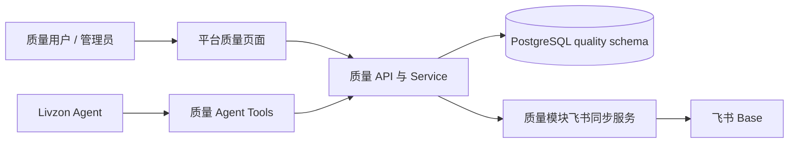

# 质量管理新增交接包适配合并 Spec

> 版本：v1.0  
> 日期：2026-07-13  
> 状态：阶段 5 已完成  
> 对应任务账本：`docs/tasks/quality-module-handoff-integration-tasks-2026-07-13.md`  
> 交接包：`E:\飞书\Download\质量管理新增内容交接_20260712\质量管理新增内容交接_20260712`

## 1. 背景

平台已在 2026-07-06 完成一轮质量模块迁移，现有能力包括偏差、CAPA、变更、验证、CPV、质量 AI、质量飞书设置和同步。2026-07-12 交接包在另一条代码与迁移基线上补充了检验管理、OOS/OOT、供应商、投诉、退货召回和产品质量标准等能力。

本 Spec 的目标是将交接包的有效业务能力适配到当前平台，而不是将交接包作为完整代码基线覆盖进项目。

## 2. 核心决策

### 2.1 平台优先

以下内容是唯一事实来源，交接包不得覆盖：

- 当前 `dazah-backend/app/modules/quality/` 的模型、服务、路由、Agent 工具和飞书设置体系。
- 当前 `dazah-frontend/src/app/(dashboard)/quality/`、`components/quality/`、`actions/quality.ts`、`lib/api/quality.ts` 的架构与已实现能力。
- 当前 Alembic head `07d131578c71` 及现有 OpenAPI/生成类型。
- 质量模块现有 PostgreSQL 数据和飞书实体绑定配置。

交接包作为以下内容的参考来源：业务范围、字段语义、飞书表字段映射、页面信息架构、测试场景和模板需求。

### 2.2 合并粒度

按“业务功能切片”重建，不按“文件复制”合并。所有同路径文件均以当前平台版本为底，逐个提取缺失行为；不执行覆盖式复制。

### 2.3 数据主权

质量模块 PostgreSQL 是唯一业务事实来源。飞书 Base 是模块级双向协作、展示和受控同步系统，不承担唯一数据源角色。



## 3. 已审计交接包范围

| 范围 | 与平台相同 | 同路径不同 | 仅交接包新增 |
| --- | ---: | ---: | ---: |
| 后端质量模块 | 8 | 14 | 45 |
| 前端质量模块 | 9 | 23 | 85 |
| 后端测试 | 4 | 1 | 2 |
| Alembic 迁移 | 0 | 0 | 13 |

交接包包含 49 个质量前端页面、59 个质量组件和 277 个路由装饰器。它的新增业务路由主要来自检验、OOS/OOT、投诉召回、供应商和产品质量子域。

当前平台已有一份迁移记录 `docs/quality-module-migration-2026-07-06.md`。本次工作只补齐该记录未涵盖的业务子域，不重复迁移其已完成内容。

## 4. 功能范围

### 4.1 保留并不得回退的既有能力

- 偏差、CAPA、变更、验证、CPV、质量 AI、部门联系人。
- 质量模块飞书应用设置、实体设置、字段映射、同步冲突和加密凭据管理。
- 质量 Agent Tools、审计、确认和权限链路。
- 前端 Server Component、Server Action、OpenAPI 生成类型和统一质量组件出口。

### 4.2 本次计划纳入的能力

| 功能切片 | 后端实体 / 资源 | 前端入口 | 飞书集成 |
| --- | --- | --- | --- |
| 检验管理 | 实验室项目、仪器、检验记录、成品/固体/液体检验、趋势预警 | `/quality/inspection/**` | 物料、仪器、成品检验台账与趋势数据 |
| OOS/OOT | OOS/OOT 台账、OOT 产品限度、OOT 限度项 | `/quality/oos-oot/**` | OOS、OOT、报告记录、调查推送等台账 |
| 供应商 | 供应商与资质台账 | `/quality/suppliers/**` | 供应商资质与看板 |
| 投诉与召回 | 投诉、退货申请、退货/召回台账 | `/quality/complaints/**`、`/quality/return-recalls/**` | 投诉与退货/召回台账 |
| 产品质量标准 | 产品质量标准及明细 | `/quality/product-quality/**` | 产品质量标准相关实体 |

### 4.3 明确排除

- 交接包中的 `__pycache__`、`.pyc`、`.orig`、临时产物和重复模板。
- 交接包全部 13 个历史 Alembic revision。
- 已在交接包后续迁移中被废弃的 `quality_documents`、`self_inspection_records`、`adverse_reaction_records`。
- 手写 API 请求/响应 TypeScript 类型作为 API 契约。
- 在客户端或 `lib/api` 内直接发起的写请求。
- 在平台或其他业务模块中新建质量专用飞书配置、同步或表模型。

## 5. 数据与迁移策略

### 5.1 交接包迁移不可复用

交接包的迁移链包含旧分支 merge，且引用包外 revision；其中还包含业务表 `DROP TABLE`。因此禁止运行、复制或以其 `down_revision` 为基础创建迁移。

### 5.2 新迁移原则

1. 每次新迁移前运行 `uv run alembic heads`，确认仅一个 head，再运行 `uv run alembic upgrade head`。
2. 模型与迁移必须成对提交，revision 由 Alembic 生成，`down_revision` 必须指向当时的当前 head。
3. 所有表使用 `quality` schema、继承共享 `BaseModel`、不创建数据库外键，并显式声明索引和唯一约束。
4. 新增 schema 或空库建表迁移在 `upgrade()` 开头包含 `CREATE SCHEMA IF NOT EXISTS quality`。
5. 迁移只包含本次功能相关的建表、索引、字段变更和可重复执行的必要配置初始化；禁止混入其他模块 drift 或未确认的 `DROP TABLE`。
6. 每个写入模型按软删除语义设计；更新后使用受控 re-fetch 返回，禁止 `await db.refresh(...)`。

### 5.3 建表分组

| 迁移组 | 目标表 |
| --- | --- |
| 检验基础 | `lab_items`、`lab_instruments`、`inspection_records`、`finished_product_inspections`、`solid_material_inspections`、`liquid_material_inspections` |
| 检验趋势 | 阶段 2 使用平台本地数据即时计算；仅在确认收件人、升级时限和去重规则后，才新增持久化通知表 |
| OOS/OOT | `oos_oot_records`、`oot_limit_products`、`oot_limit_items` |
| 外部质量 | `complaint_records`、`return_recall_records`、`suppliers`、`product_quality_records` |

在生成迁移前，必须使用目标数据库的 `information_schema` 检查上述表是否已存在。若联调库已有同名表，先做字段兼容审计，再编写 ALTER 或数据回填迁移，不能盲目创建或删除。

### 5.4 历史数据决策

默认实施范围为“功能与结构迁移”，不凭空生成历史数据。若业务要求迁移历史台账、检验记录或飞书 record ID，必须额外提供：

- 源库只读连接或版本化脱敏导出；
- 每张表的主键、状态和时间字段映射；
- 飞书 record ID、表 ID、同步方向和冲突优先级；
- 去重规则、失败记录回滚与核对报表要求。

在上述输入缺失时，历史系统保持只读可追溯，新功能从上线日起写入平台数据库。

## 6. 后端设计

### 6.1 模块边界

所有新增业务代码仅位于 `app/modules/quality/`：

```text
models/       SQLAlchemy 2.0 typed ORM
schemas/      Pydantic v2 输入输出契约
repository/   查询与持久化细节
service/      业务规则、同步、导出与事务编排
api/          路由、依赖、参数与响应薄层
agent_tools.py 需要暴露给 Livzon 的受控业务工具
```

跨模块数据仅通过目标模块 `public_api.py` 或既有扩展点协作。不得让质量模块直接导入其他模块的 repository、service、飞书配置或内部模型。

### 6.2 API 设计

- 路径统一为 `/api/v1/quality/<resource>`。
- 每个子域提供 list、detail、create、update、soft-delete；列表接口具备分页、状态筛选和关键词检索。
- 检验、趋势和飞书回拉等查询接口使用明确的 resource 名称，避免与现有 CPV、偏差和验证路由重名。
- 固定资源路径必须先于 `/{id}` 参数路径注册。例如 `/oos-oot/oos-ledger`、`/oos-oot/oot-limits` 必须先于 `/oos-oot/{record_id}`。
- Router 只处理 HTTP 层；不得在 route 内构造复杂 SQL 或绕过 service/repository。

### 6.3 异步 ORM 与删除规范

- INSERT：`flush()` 后返回已回填对象即可。
- UPDATE / DELETE：`flush()` 后通过 `select` 和所需 `selectinload` 重新查询，再序列化响应。
- 删除统一更新 `is_deleted`，默认查询排除已删除记录。
- 不修改未加载 relationship，不在业务代码中调用 `db.refresh()`。

### 6.4 质量 Agent 能力

在每个功能切片稳定后，评估是否在 `quality.agent_tools` 增加只读工具。写工具必须由 `ToolExecutor` 生成确认项；审批、驳回、质量责任判断及其他 `human_decision_required` 操作不得交由 Agent 自动执行。

## 7. 飞书集成设计

### 7.1 配置与安全

- 继续使用质量模块的 `QualityFeishuAppSettings`、`QualityFeishuEntitySetting` 和加密服务。
- 交接包新增的实体只扩展质量模块实体注册、表映射和字段映射，不创建平台统一飞书配置表。
- 质量服务从自身设置表读取、解密和校验凭据，再将显式 `app_id`、`app_secret`、`app_token`、`table_id` 传入平台 helper。
- 环境变量仅作为开发预填或模块自身兼容兜底；不得返回、记录或暴露 secret、token、password、key。

### 7.2 同步语义

- 平台数据库创建、更新后可按实体配置推送至飞书。
- 飞书回拉仅处理已映射的质量实体；未知表、缺字段、非法状态和无效 record ID 必须产生可读错误或同步冲突，而非静默写入。
- 每次同步需要记录实体、方向、目标记录标识、结果摘要和脱敏错误；不记录明文凭据和完整第三方 payload。
- 先实现单实体幂等和冲突处理测试，再逐步开放批量回拉与趋势刷新。

## 8. 前端设计

### 8.1 目录与数据流

- `app/(dashboard)/quality/**/page.tsx` 仅做 Server Component 数据获取与布局组装；运行时取数页面声明 `dynamic = 'force-dynamic'`。
- 可交互视图位于 `components/quality/`，新对外组件通过 `components/quality/index.ts` 导出。
- GET/list/detail/search 使用 `lib/api/quality.ts` 的相对路径请求。
- POST/PUT/PATCH/DELETE、上传、同步和导入确认全部在 `actions/quality.ts` 中实现 Server Action。
- API 类型全部来自 `types/generated/schema.ts`；`types/quality.ts` 仅允许保留非 API 的展示或状态类型。

### 8.2 页面与导航

按功能切片将交接包页面适配为以下质量菜单分组：

1. 检验管理：仪器、项目、成品检验、物料检验、趋势看板。
2. OOS/OOT：台账、调查推送、报告记录、产品部门、OOT 限度。
3. 外部质量：供应商、投诉、退货召回、产品质量标准。

仅在当前 `menu-config.ts` 的质量分组内精确插入新节点；不得覆盖其他模块菜单。页面和组件使用既有 Ant Design v6、当前质量页面模式以及 `DESIGN.md` 的颜色、排版、间距、状态和响应式要求。

### 8.3 交互质量

每个新页面必须覆盖加载、空态、失败、无权限、分页、筛选、提交失败与成功反馈。写操作在 Action 失败时返回可读错误，成功后刷新相关数据；不得在浏览器端持有或拼接后端地址与飞书凭据。

## 9. 分期实施计划

| 阶段 | 交付物 | 主要依赖 | 完成标准 |
| --- | --- | --- | --- |
| 0 | 基线审计、Spec、任务账本 | 无 | 文档回读，范围与排除项明确 |
| 1 | 检验基础模型、迁移、CRUD、OpenAPI | 当前质量模型与飞书设置 | 迁移可升级，检验 API 与测试通过 |
| 2 | 检验飞书映射、趋势、前端页面 | 阶段 1 | 单实体同步/趋势测试与页面验收通过 |
| 3 | OOS/OOT 与 OOT 限度全链路 | 阶段 1 | 已完成：路由无静态路径遮蔽，台账、限度、飞书映射与独立库测试通过 |
| 4 | 供应商、投诉、召回、产品质量 | 阶段 1 | 各子域 CRUD、飞书映射和前端页面通过 |
| 5 | Agent 扩展、回归、发布准备 | 阶段 1-4 | 已完成：只读 Agent 能力、前端契约治理、质量回归和迁移检查通过 |

每个阶段开始前和结束后均更新本 Spec 的状态及对应任务账本；阶段之间不得跳过数据库、API 契约和前端生成类型同步。

## 10. 测试与验收

### 10.1 后端

- Model / migration：新表、索引、软删除、升级与回滚行为。
- Repository / service：分页筛选、状态转换、更新回读、幂等同步与冲突处理。
- API：参数校验、正常路径、权限、空结果、路由顺序和导出。
- 飞书：无配置、错误配置、字段缺失、同步失败、回拉去重和凭据脱敏。
- Agent：仅新增已稳定的只读工具；写工具确认、审计和责任判断策略测试。

### 10.2 前端

- 页面 Server/Client 边界、菜单可达性、筛选分页和状态反馈。
- 所有写操作只经 Server Action。
- OpenAPI 类型生成后不存在手写 API 契约替代。
- 关键窄屏布局、表格横向滚动、表单校验和错误提示。

### 10.3 必须执行的验证

```powershell
cd dazah-backend
uv run pytest tests/modules/quality -q
uv run ruff check app/modules/quality tests/modules/quality
uv run alembic heads
uv run alembic upgrade head
uv run python scripts/export_openapi.py

cd ..\dazah-frontend
pnpm generate:api
pnpm typecheck
```

若 `alembic check` 或全项目 typecheck 暴露既有漂移/既有错误，任务账本必须明确区分本次引入的问题和已有问题，不得用无关重构掩盖失败。

### 10.4 独立测试库

- 质量模块测试固定使用独立 PostgreSQL 数据库 `dazah_test`，不得使用开发库 `dazah`。
- `tests/db_safety.py` 会拒绝数据库名不含 `test`、`testing` 或 `pytest` 的 pytest 连接；不得设置 `PYTEST_ALLOW_UNSAFE_DATABASE_URL=1`。
- 后续运行统一使用以下命令。运行器从本地 `DATABASE_URL` 派生同服务器的 `dazah_test` 连接，并且只向 Alembic、pytest 子进程注入 `DATABASE_URL` 与 `TEST_DATABASE_URL`，不输出凭据：

```powershell
cd dazah-backend
uv run python scripts/run_quality_tests.py
```

- 已验证 `dazah_test` 在 `07d131578c71 (head)`，阶段 2 后质量模块全量回归为 `130 passed`。现有开发库不参与该测试过程。
- 本阶段新增和改动文件的 Ruff 检查通过；现有质量模块全量 Ruff 仍有 1,008 项历史格式/规则问题，需在独立质量治理任务中处理，不得混入业务迁移。

## 11. 发布与回滚

1. 每个功能切片独立提交，模型与迁移在同一提交中。
2. 合并前确认只有一个 Alembic head、OpenAPI 和生成类型已同步。
3. 首次上线默认关闭新飞书实体的批量回拉，仅开放管理员配置与单实体连通测试。
4. 观察同步错误、冲突数量、API 错误率和页面失败反馈后再逐步开放批量同步。
5. 回滚优先关闭菜单、功能开关或同步入口；数据库回滚只执行已验证且不丢失生产数据的本次迁移 downgrade。

## 12. 当前状态与后续入口

阶段 0 已完成：已完成交接包与平台差异审计，已确认平台主导、历史迁移不可复用、历史数据需单独输入。

阶段 1、阶段 2、阶段 3 已完成：检验基础、检验飞书/趋势、OOS/OOT 受控台账、OOT 限度、手动飞书推送、OpenAPI、前端生成类型和独立数据库测试均已完成。

阶段 5 已完成：检验、OOS/OOT、供应商、投诉、退货召回和产品质量新增只读 Agent 能力并同步 Hermes 白名单；前端质量 API/Server Actions 清除显式 `any`，修复 CAPA 执行记录、删除执行记录、完成分段和效果评价的路由及请求契约。独立 `dazah_test` 质量回归 `137 passed`，Agent 专项 `6 passed`，前端 typecheck、目标 ESLint/Ruff、Python 编译和单 Alembic head 检查均通过。

### 阶段 5 实施记录（2026-07-15）

- 新增八个只读质量 Agent 工具：检验记录列表/详情、OOS/OOT 列表/详情、供应商、投诉、退货召回和产品质量记录查询；全部 `write=False`、允许工作流调用，不开放审批、驳回或其他质量责任判断。
- 同步 `Hermes-Lite/tools/dazah_platform.py` 静态白名单，并扩展注册、策略、白名单一致性和检验查询委派测试。
- 修复 CAPA 页面与后端不一致的执行记录新增/删除、效果评价、执行确认和分段完成请求；执行记录表单和展示字段与后端 `ExecutionTrack` 契约对齐。
- `src/actions/quality.ts` 和 `src/lib/api/quality.ts` 显式 `any` 清零；偏差、CAPA 等分页读取统一解析后端 `data + meta` 响应，写操作继续只经 Server Action。
- 修正生产标签复核 Server Action 误用 `/api/v1/quality/label-verifications` 的路径，恢复为后端实际的 `/api/v1/production/label-verifications`。
- 本阶段没有新增 HTTP API 或数据库模型，因此无需新增 Alembic revision，也无需重生成 OpenAPI；当前迁移链保持单一 head。
- 验证：质量模块 `137 passed, 41 warnings`；Agent 专项 `6 passed, 39 warnings`；`pnpm typecheck`、目标 ESLint、目标 Ruff、`compileall` 和 `alembic heads` 均通过。

### 阶段 4 实施记录（2026-07-13）

- 新增六张 `quality` schema 表及 revision `b272bca6fada_add_quality_external_foundation.py`：供应商、供应商资质、投诉、退货召回、产品质量记录和产品质量标准明细。新表使用软删除、索引和 UUID 审计列，所有业务关联由 service 层校验，不创建数据库外键。
- 投诉、退货/召回与产品质量分别使用受控状态机；不允许跳过调查、评估、处置或评审结论。删除供应商或产品质量记录时，关联子记录由 service 层受控软删除。
- 在当前质量飞书设置体系中增加六个实体，默认仅允许手动单条推送、关闭回拉；不复制交接包的直连飞书凭据、硬编码 Base 或自动回写策略。
- 新增外部质量后端分层、专项测试和前端四个 Server Component 路由。互动工作台使用 React Query 和 Ant Design，写操作全部调用 Server Action，读取与请求/响应类型全部来自 OpenAPI 生成 schema。
- OpenAPI 生成时采购与质量的同名供应商响应对象被生成器命名空间消歧；前端仅更新到对应生成类型键，不引入手写 API 类型。
- 独立 `dazah_test` 已升级至 `b272bca6fada`，六张目标表均存在，目标表外键数为零；专项 API 回归 `4 passed, 39 warnings`，恢复后的容器网络全量质量回归为 `137 passed, 41 warnings in 17.46s`，定向 Ruff 与前端 typecheck 通过。开发库从未作为替代测试库使用。

### 阶段 1 审计记录（2026-07-13）

- 当前质量模块没有 `lab_items`、`lab_instruments`、`inspection_records`、成品/固体/液体检验记录或趋势预警模型。
- 平台存在同名 `equipment.inspection_records`，它属于设备模块；质量检验记录必须创建在独立的 `quality.inspection_records`，不得复用或修改设备模块表。
- 审计开始时，当前连接数据库 revision 是唯一 head `6c9b3dc4b141`；本阶段新迁移已由该 head 演进至 `07d131578c71`。
- 已通过 `information_schema.tables` 只读核验：上述七张计划新增的检验基础表在当前 `quality` schema 中均不存在；不存在需要先 ALTER、回填或清理的同名历史表。
- 交接包检验模型字段可作为业务语义参考，但其模型没有覆盖当前平台所需的显式查询索引、异步 service/repository、OpenAPI 契约与软删除测试，因此需要按本 Spec 重建。

### 阶段 1 实施记录（2026-07-13）

- 新增质量检验基础模型：实验室物品、实验室仪器、通用检验记录、成品检验、固体物料检验和液体物料检验。
- 新增对应 Pydantic v2 请求/响应契约、repository、service 和 30 个显式 CRUD 路由；写路径经 service/repository 完成，更新后受控 re-fetch，未使用 `db.refresh()`。
- 新增 Alembic revision `07d131578c71_add_quality_inspection_foundation.py`，从 `6c9b3dc4b141` 演进，开发库已升级至该唯一 head。
- 迁移只创建上述六张 `quality` schema 表和索引；升级路径无删除操作、无外键。实库核验得到 6 张表、23 个索引、0 个外键。
- 新模型覆盖共享审计基类中的外键元数据为无外键 UUID 审计列；完整业务模型加载后的针对性 Alembic metadata 对比结果为 `inspection_foundation_drift_count=0`。
- 后端 OpenAPI 已重新导出；前端已执行 `pnpm generate:api` 和 `pnpm typecheck`，均通过。

### 阶段 1 独立测试库验证记录（2026-07-13）

- 已确认独立 PostgreSQL 测试库 `dazah_test`，并将其升级至 `07d131578c71 (head)`；测试命令只向子进程传入该库连接，未将开发数据库用于 pytest。
- 专项 `tests/modules/quality/test_inspection_api.py` 通过 `7 passed`；质量模块全量 `tests/modules/quality` 通过 `126 passed, 41 warnings`。
- 原有质量 API 测试在平台路由级模块授权启用后会收到 401；已在质量测试包级 fixture 中注入管理员测试身份，测试仍经由实际授权依赖执行。
- 新增 `dazah-backend/scripts/run_quality_tests.py` 作为后续阶段唯一推荐测试入口；它对测试数据库名称执行安全校验，并不记录或输出连接凭据。

### 阶段 2 实施记录（2026-07-13）

- 在质量模块既有飞书设置体系中注册六个检验实体及其字段对齐项；新实体默认启用推送、关闭回拉，确保平台 PostgreSQL 继续是检验业务唯一事实来源。
- 新增 `/api/v1/quality/inspection-dashboard`、`/inspection-trends` 与 `/inspection-resources/{resource_code}/{record_id}/sync-to-feishu`。趋势 API 按产品/物料、检验项目计算数值趋势、标准限度和控制限预警；飞书接口仅处理用户明确发起的单条推送。
- 未复用交接包按产品硬编码、直接读写飞书的页面和服务；未增加趋势通知表或自动消息，因为交接包未提供可核验的收件人、升级时限和业务责任规则。
- 新增检验管理前端页面、菜单入口、局部 React Query Provider、趋势预警表和 Server Action；后端 OpenAPI 与前端生成类型已同步。
- 独立 `dazah_test` 库中，阶段 2 专项测试 `4 passed`，质量模块全量回归 `130 passed, 41 warnings`，`pnpm typecheck` 通过。

### 阶段 3 实施记录（2026-07-13）

- 交接包 OOS/OOT 源码仅作为字段语义和页面信息架构参考：其直接 ORM 写入、`db.refresh()`、无鉴权端点、数据库外键和硬编码飞书实现均不进入平台。
- 新增 `quality.oos_oot_records`、`quality.oot_limit_products`、`quality.oot_limit_items` 和 Alembic revision `7a69407edc70`。三表均使用质量 schema、软删除和 UUID 审计列；`oot_limit_items.product_id` 是经 service 校验的应用层关联，不创建数据库外键。
- 台账状态机固定为 `open → investigating → closed`，关闭强制调查结论，禁止对已关闭记录再编辑或重新发起调查。OOT 限度产品删除时由业务层软删除其限度项目；产品内显示顺序同时受唯一约束和业务校验保护。
- 在既有质量飞书设置中新增 `oos_ledger`、`oot_ledger`、`oot_limit_product`、`oot_limit_item`。全部默认推送开启、回拉关闭，前端只调用用户明确发起的单条推送 API；不迁移旧飞书凭据或历史 record ID。
- 新增 `/quality/oos-oot` 页面、质量菜单入口、React Query 局部 Provider 和 Server Actions。页面支持台账筛选、创建、启动调查、关闭、飞书推送，以及 OOT 产品和项目维护；所有 API 类型来自重新生成的 OpenAPI schema。
- 测试仅使用 Docker 容器网络中的 `dazah_test`。该库升级至 `7a69407edc70`，三张新表已存在且外键数为零；阶段 3 专项 `3 passed`，质量模块全量 `133 passed, 41 warnings`，`pnpm generate:api`、`pnpm typecheck` 通过。
- 宿主机到 PostgreSQL 的端口连接被拒绝（`WinError 1225`），因此使用容器内显式的测试数据库连接完成迁移和 pytest；开发库 `dazah` 未参与本阶段任何迁移或测试。
- 全局 `alembic check` 仍因产品、身份、采购、仓储等既有跨模块 drift 失败；本阶段三张质量表未产生新增 drift，不创建无关修复迁移。
